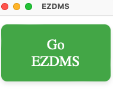
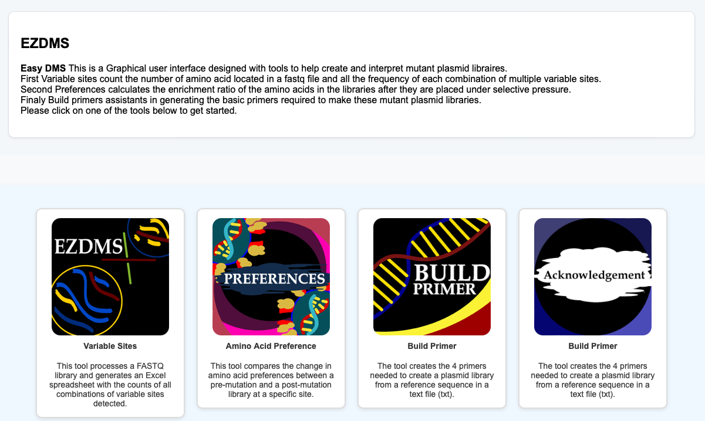
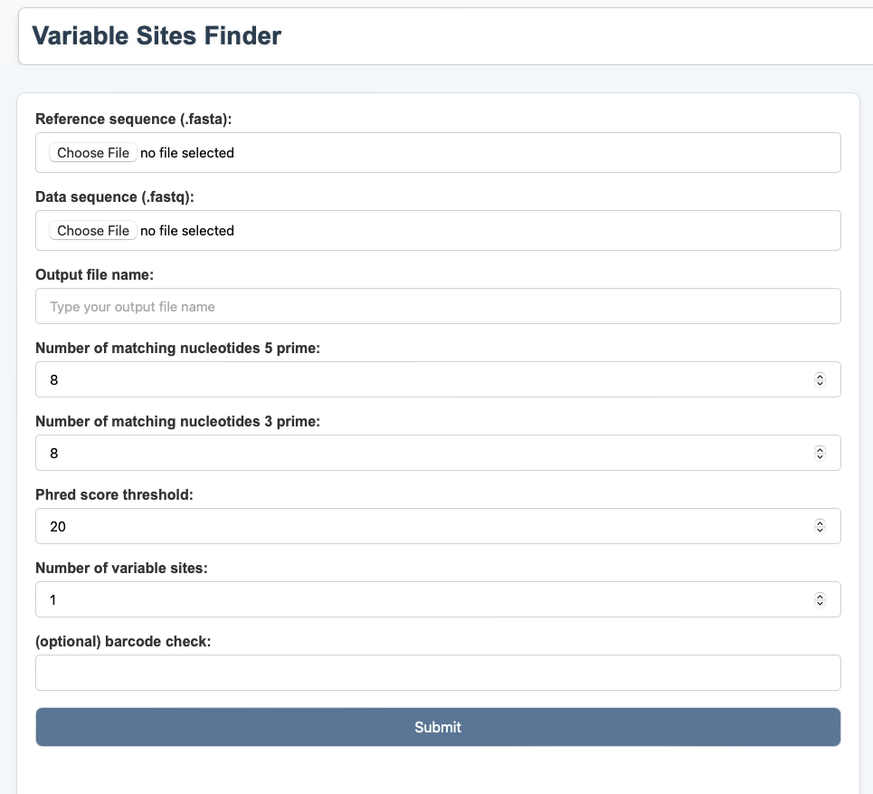
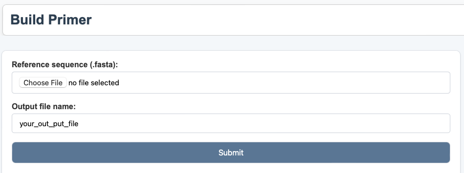

# EZDMS 

EZDMS is a python-based GUI to help in preforming ressearch mutated plasmid libraries. 

## Installation 

you can download the this package from git hub (https://github.com/haimlab/EZDMS)
 
# EZDMS 

EZDMS is a python-based GUI to help in preforming ressearch mutated plasmid libraries. 

## Installation 

you can download the this package from git hub (https://github.com/haimlab/EZDMS)
 
Requirements: 
 
**Python >= 3.7** 
 
**webview**
 
**Flask**
 
**flask_cors** 
 
**requests**
 
Before running the code, you will need to install the requirements of EZDMS. If you do not have these libraires you can install them using the pip commands bellow. 
 

```bash
    pip install pywebview
    pip install Flask 
    pip install flask_cors  
    pip install requests 
```

## Running

To run EZDMS after use: 
```bash 
Python EZDMS.py 
``` 
 
This will open the GUI program. 



You can exit the program by closing this window. 

You can move to the main page of the program by pressing the Go EZDMS button. 
 
 
 
This page links to all the tools on EZDMS just click on any of the icons or use the navigation bat in the top right. 


## Variable Sites Finder

he primary tool of EZDMS is Variable Site Finder, which counts each mutant amino acid detected in a plasmid library. The program matches the nucleotides flanking a variable site in the library to identify the mutant amino acid. Multiple variable sites can be searched at once to count all detected amino acid combinations between variable sites. Barcode sequences can be added so each count is based only on sequences containing the specific barcode. This can be used to separate out counts from contaminated sequences from the intended library plasmid counts. This tool takes two files as inputs, a fasta reference that have the variable sites codons labeled with the nonstandard nucleotides and the fastq plasmid library. The output of the program is an excel sheet with a page for each barcode sequence and a dictionary on each page for all the amino acid combinations with the counts detected in the library.   



## Amino Acid Preferences

Amino Acid Preferences is a tool to calculate the relative selective pressures for each amino acid a variable site might adopt. The program is based on the equation for the naive approach to Enrichment Ratio from dms_tools.1 The Enrichment Ratio for amino acid ‘y’ and a wild type amino acid of ‘WT’ is calculated as the ratio of ‘y’ to ‘WT’ after infection divided by the ratio of ‘y’ to ‘WT’ before infection. The Enrichment Ratio for all amino acids at a site are then rescaled to one for the final output of amino acid preferences at that site. This tool takes three files as inputs a fasta reference with variable sites codons labeled with the nonstandard nucleotides and two fastq libraires of the sequenced plasmids, the preselection libraries and the libraries sequenced after infection. The output file is a CSV file that has the preference for each amino acid labeled.   


## Build Primer

The final function is a basic primer template generator to create a single NNK site in a plasmid fragment. The code identifies the longest primer to be constructed to produce the NNK site with appropriate ending nucleotides and identifies all palindromic sites in a primer that could lead to self-binding. The input for this file is a fasta reference sequence for the plasmid fragment with an NNk site labeled at the codon to be mutated. The output of the tool is a text file with the 2 forward and 2 reveres primers labeled with their length and an index of all sites that are potently problematic within each primer. 



## Run Modules

find_variable_sites command lines:
 
**Python >= 3.7** 
 
**webview**
 
**Flask**
 
**flask_cors** 
 
**requests**
 
Before running the code, you will need to install the requirements of EZDMS. If you do not have these libraires you can install them using the pip commands bellow. 
 

```bash
    pip install pywebview
    pip install Flask 
    pip install flask_cors  
    pip install requests 
```

## Running

To run EZDMS after use: 
```bash 
Python EZDMS.py 
``` 
 
This will open the GUI program. 


You can exit the program by closing this window. 

You can move to the main page of the program by pressing the Go EZDMS button. 
 
 
 
This page links to all the tools on EZDMS just click on any of the icons or use the navigation bat in the top right. 


## Variable Sites Finder

he primary tool of EZDMS is Variable Site Finder, which counts each mutant amino acid detected in a plasmid library. The program matches the nucleotides flanking a variable site in the library to identify the mutant amino acid. Multiple variable sites can be searched at once to count all detected amino acid combinations between variable sites. Barcode sequences can be added so each count is based only on sequences containing the specific barcode. This can be used to separate out counts from contaminated sequences from the intended library plasmid counts. This tool takes two files as inputs, a fasta reference that have the variable sites codons labeled with the nonstandard nucleotides and the fastq plasmid library. The output of the program is an excel sheet with a page for each barcode sequence and a dictionary on each page for all the amino acid combinations with the counts detected in the library.   


## Amino Acid Preferences

Amino Acid Preferences is a tool to calculate the relative selective pressures for each amino acid a variable site might adopt. The program is based on the equation for the naive approach to Enrichment Ratio from dms_tools.1 The Enrichment Ratio for amino acid ‘y’ and a wild type amino acid of ‘WT’ is calculated as the ratio of ‘y’ to ‘WT’ after infection divided by the ratio of ‘y’ to ‘WT’ before infection. The Enrichment Ratio for all amino acids at a site are then rescaled to one for the final output of amino acid preferences at that site. This tool takes three files as inputs a fasta reference with variable sites codons labeled with the nonstandard nucleotides and two fastq libraires of the sequenced plasmids, the preselection libraries and the libraries sequenced after infection. The output file is a CSV file that has the preference for each amino acid labeled.   


## Build Primer

The final function is a basic primer template generator to create a single NNK site in a plasmid fragment. The code identifies the longest primer to be constructed to produce the NNK site with appropriate ending nucleotides and identifies all palindromic sites in a primer that could lead to self-binding. The input for this file is a fasta reference sequence for the plasmid fragment with an NNk site labeled at the codon to be mutated. The output of the tool is a text file with the 2 forward and 2 reveres primers labeled with their length and an index of all sites that are potently problematic within each primer. 


## Run Modules

find_variable_sites command lines:

usage: find_variable_sites.py [-h] [-o OUTPUT] [-p PHREAD] [-5 FIVE_PRIME] [-3 THREE_PRIME] [-v VARIABLE] fasta fastq
usage: find_variable_sites.py [-h] [-o OUTPUT] [-p PHREAD] [-5 FIVE_PRIME] [-3 THREE_PRIME] [-v VARIABLE] fasta fastq

Example command line:
Example command line:

python find_variable_sites.py Ref_375X BNKWKD_3_Library_375X.fastq -o "out.txt" -p 20 -5 8 -3 8 -v 2
python find_variable_sites.py Ref_375X BNKWKD_3_Library_375X.fastq -o "out.txt" -p 20 -5 8 -3 8 -v 2